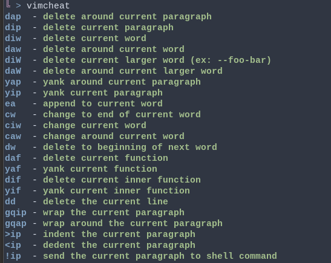

# Learning VIM

A couple of programs and commands to learn vim from the terminal

## Programs

- [rwxrob learnvim](https://github.com/rwxrob/learnvim)
- `vimtutor` - Command included in vim with a little tutorial

## Commands

Cheatsheet to start working with vim

```vim
dap  - delete around current paragraph
dip  - delete current paragraph
diw  - delete current word
daw  - delete around current word
diW  - delete current larger word (ex: --foo-bar)
daW  - delete around current larger word
yap  - yank around current paragraph
yip  - yank current paragraph
ea   - append to current word
cw   - change to end of current word
ciw  - change current word
caw  - change around current word
dw   - delete to beginning of next word
daf  - delete current function
yaf  - yank current function
dif  - delete current inner function
yif  - yank current inner function
dd   - delete the current line
gqip - wrap the current paragraph
gqap - wrap around the current paragraph
>ip  - indent the current paragraph
<ip  - dedent the current paragraph
!ip  - send the current paragraph to shell command
```

It's possible to store this in a little script to call it from your terminal any time you want

```bash
#!/bin/bash

g=
c=
r=

if test -t 1; then
  g="\e[1;32m"
  c="\e[1;34m"
  r="\e[0m"
fi

echo -e "${c}dap${r}  - ${g}delete around current paragraph${r}"
echo -e "${c}dip${r}  - ${g}delete current paragraph${r}"
echo -e "${c}diw${r}  - ${g}delete current word${r}"
echo -e "${c}daw${r}  - ${g}delete around current word${r}"
echo -e "${c}diW${r}  - ${g}delete current larger word (ex: --foo-bar)${r}"
echo -e "${c}daW${r}  - ${g}delete around current larger word${r}"
echo -e "${c}yap${r}  - ${g}yank around current paragraph${r}"
echo -e "${c}yip${r}  - ${g}yank current paragraph${r}"
echo -e "${c}ea ${r}  - ${g}append to current word${r}"
echo -e "${c}cw ${r}  - ${g}change to end of current word${r}"
echo -e "${c}ciw${r}  - ${g}change current word${r}"
echo -e "${c}caw${r}  - ${g}change around current word${r}"
echo -e "${c}dw ${r}  - ${g}delete to beginning of next word${r}"
echo -e "${c}daf${r}  - ${g}delete current function${r}"
echo -e "${c}yaf${r}  - ${g}yank current function${r}"
echo -e "${c}dif${r}  - ${g}delete current inner function${r}"
echo -e "${c}yif${r}  - ${g}yank current inner function${r}"
echo -e "${c}dd${r}   - ${g}delete the current line${r}"
echo -e "${c}gqip${r} - ${g}wrap the current paragraph${r}"
echo -e "${c}gqap${r} - ${g}wrap around the current paragraph${r}"
echo -e "${c}>ip${r}  - ${g}indent the current paragraph${r}"
echo -e "${c}<ip${r}  - ${g}dedent the current paragraph${r}"
echo -e "${c}!ip${r}  - ${g}send the current paragraph to shell command${r}"

```

So you get something like this


